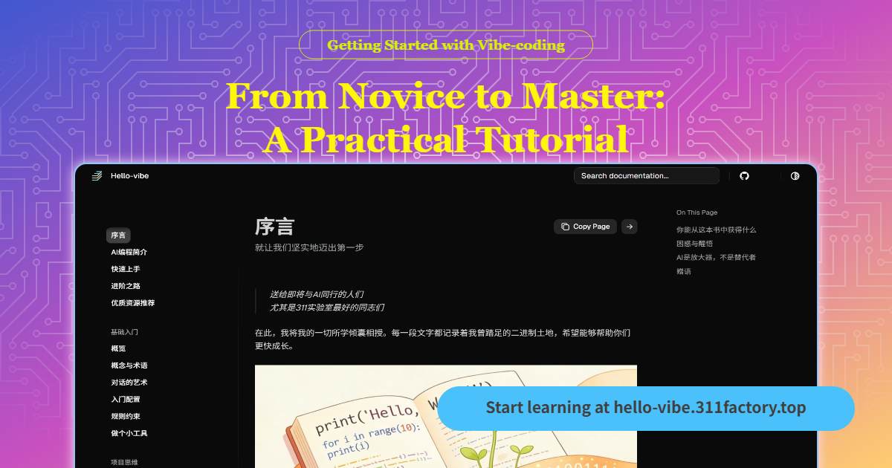

<p align="center">
  
</p>

<p align="center">
  
  </br>
  AI 编程入门指南 —— 从初学者到修行者的实战教程
</p>

<p align="center">
  <a href="https://hello-vibe.311factory.top/">
    </a>
</p>

<p align="center">
  <a href="https://github.com/jspi-fu/hello-vibe"></a>
  <a href="https://gitee.com/ye_sheng0839/hello-vibe"></a>
  <a href="https://zread.ai/jspi-fu/hello-vibe" target="_blank"></a>
  <a href="https://creativecommons.org/licenses/by-nc-sa/4.0/"></a>
</p>

<p align="center">
  <a href="#快速开始"></a>
  <a href="#核心理念"></a>
  <a href="#文档结构"></a>
  <a href="#contributing"></a>
</p>

---

## 简介

**Hello-vibe** 是一份面向零基础学习者的 AI 编程入门教程，专注于 **Vibe Coding（氛围编程）** 的核心理念与实践方法。

> 送给即将与AI同行的人们，尤其是311实验室最好的同志们。
> —— 烨笙，二零二六年春，于南京

这份教程记录了我曾踏足的二进制土地，希望能够帮助你们更快成长。从理解 AI 编程的基本概念，到亲手为自己定制实用工具，再到掌握高阶技巧、完成从程序员到项目师的思维转变。

## 核心理念

**AI 是放大器，不是替代者。**

它能生成代码，但不能理解为什么需要这段代码。它能放大那些懂得提问的人的能力，也放大那些不愿思考的人的懒惰。

这份教程不会教你如何让 AI 替你工作——那样的营销在网上到处都是。我想和你探讨的是：**如何与 AI 建立一种健康的协作关系**。

- 什么时候应该信任它的建议，什么时候必须保持警惕
- 如何让 AI 帮你跨越知识盲区，又不至于在盲区里越陷越深
- 如何在享受效率提升的同时，守住作为程序员的判断力和责任感

## 你能从这本书中获得什么

- ✅ **理解 AI 编程的概念并快速上手**
- ✅ **亲手为自己定制一份实用工具**
- ✅ **学习 AI 编程的高阶技巧**
- ✅ **完成从程序员到项目师的思维转变**

## 快速开始

### 在线阅读

访问在线文档：<https://hello-vibe.311factory.top>

### 本地阅读

```bash
# 克隆仓库
git clone https://github.com/jspi-fu/hello-vibe.git
cd hello-vibe

# 安装依赖
pip install -r requirements.txt

# 启动本地服务器
mkdocs serve

# 访问 http://127.0.0.1:8000
```

## 文档结构

本教程采用循序渐进的学习路线，分为四个阶段：

<details>
<summary><strong>📖 第一站：基础入门（打地基）</strong></summary> 

**"别急着写代码，先学会跟 AI 保持同频。"**

- [概念与术语](./docs/04_基础入门/01_概念与术语.md) - 扫清核心词汇障碍
- [对话的艺术](./docs/04_基础入门/02_对话的艺术.md) - 精准下达指令的策略
- [入门配置](./docs/04_基础入门/03_入门配置.md) - 搭建开发环境
- [规则约束](./docs/04_基础入门/04_规则约束.md) - 让 AI 遵守你的标准
- [做个小工具](./docs/04_基础入门/05_做个小工具.md) - 从想法到落地的实战

</details>

<details>
<summary><strong>🎯 第二站：项目思维（定方向）</strong></summary> 

**"代码写得再快，跑错了方向也是白费。"**

- [明确需求](./docs/05_项目思维/01_明确需求.md) - 精准定义问题
- [减法思维](./docs/05_项目思维/02_减法思维.md) - MVP 原则，学会"砍"需求
- [逆向思维](./docs/05_项目思维/03_逆向思维.md) - 预判失败，提前避坑
- [胶水编程](./docs/05_项目思维/04_胶水编程.md) - 组合现有能力

</details>

<details>
<summary><strong>⚙️ 第三站：高级配置（神装加身）</strong></summary> 

**"给你的 AI 助手装上记忆和双手。"**

- [IDE 插件](./docs/06_高级配置/01_IDE插件.md) - 提升开发手感的插件
- [MCP 工具](./docs/06_高级配置/02_MCP工具.md) - 接入外部能力
- [Agent Skills](./docs/06_高级配置/03_Agent%20Skills.md) - 封装标准工作流
- [Hooks](./docs/06_高级配置/04_Hooks.md) - 自动化拦截机制
- [文档集](./docs/06_高级配置/05_文档集.md) - 挂载私有知识库
- [项目管理](./docs/06_高级配置/06_项目管理.md) - 引入 SDD 规范

</details>

<details>
<summary><strong>🛡️ 第四站：高级技巧（修罗场实战）</strong></summary> 

**"处理现实世界中那些最麻烦、最恶心的问题。"**

- [上下文管理](./docs/07_高级技巧/01_上下文管理.md) - 解决 AI "失忆"问题
- [幻觉与死循环处理](./docs/07_高级技巧/02_幻觉与死循环处理.md) - 纠偏策略
- [代码质量保障](./docs/07_高级技巧/03_代码质量保障.md) - 多层拦截机制
- [代码重构](./docs/07_高级技巧/04_代码重构.md) - 优雅偿还技术债
- [成本控制](./docs/07_高级技巧/05_成本控制.md) - 节省 Token 费用
- [团队协作](./docs/07_高级技巧/06_团队协作.md) - 多人配合统一规范

</details>


> [!NOTE]
> 本项目使用 [mkdocs-shadcn](https://github.com/asiffer/mkdocs-shadcn) 主题，如需自定义主题配置，请参考 [【官方文档】](https://asiffer.github.io/mkdocs-shadcn/) 编辑 [`mkdocs.yml`](mkdocs.yml) 文件。

---

<a id="contributing"></a>

## 🤝 参与贡献

我们热烈欢迎各种形式的贡献。如果您对本项目有任何想法或建议，请随时开启一个 [Issue](https://github.com/jspi-fu/hello-vibe/issues) 或提交一个 [Pull Request](https://github.com/jspi-fu/hello-vibe/pulls)。

在您开始之前，请花时间阅读我们的 [**贡献指南 (CONTRIBUTING.md)**](CONTRIBUTING.md) 和 [**行为准则 (CODE_OF_CONDUCT.md)**](CODE_OF_CONDUCT.md)。

---

## 致谢

感谢所有为这份教程提供建议和反馈的朋友们。

特别感谢 311 实验室的同志们，是你们让这份教程有了存在的意义。

## License

© 2026 烨笙

The texts, code, images, photos, and videos in this repository are licensed under [CC BY-NC-SA 4.0](https://creativecommons.org/licenses/by-nc-sa/4.0/).

---

<p align="center">
  <sub>如果这个项目对您有帮助，请考虑为其点亮一颗 Star ⭐！</sub>
</p>